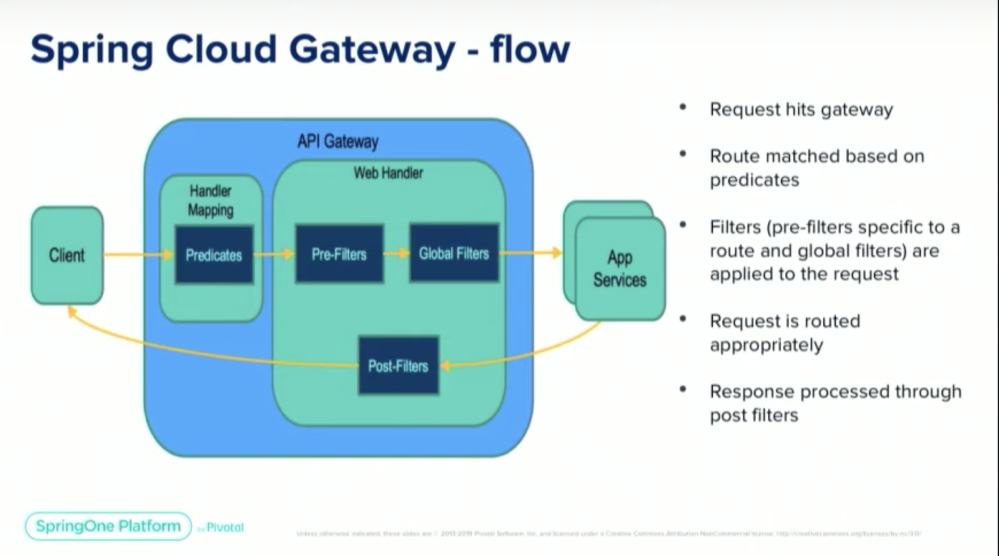

# 🍱 Vending machine  

### 🐲 Tech Stack
- Kotlin 
- Spring Boot
- Spring Cloud
- H2 database
- Gradle
- Caffeine Cache

___
## 🚀 Run

- CLI:
```shell
./gradlew -q
```
- Or just run it on your `IDE`


❗️ Please, note that this project requires `Java 17`. If you have other version of java on your local machine - 
change the version in `gradle.properties` file in the root:

```properties
java=17
```
___

## Project configuration

You are able to configure `machine` application in file `machine/src/main/resources/application.yml`:

```yaml
api:
  cors-allowed: http://localhost:3000
```
Also in this file you can change cache expiration (`10s`):
```yaml
spring:
  cache:
    caffeine.spec: expireAfterWrite=10s
```
___


## 📦 Solution


### Services
| Name              | Description                                                                                                                                                                              |
|-------------------|------------------------------------------------------------------------------------------------------------------------------------------------------------------------------------------|
| eureka-server     | Service registration and `discovery`                                                                                                                                                     |
| gateway           | The tool provides out-of-the-box routing mechanisms often used in microservices applications as a way of hiding multiple services behind a single facade.                                |
| machine           | API for a vending machine, allowing users with a “seller” role to add, update or remove products, while users with a “buyer” role can deposit coins into the machine and make purchases. |


### Tests
Code is tested with integration tests. You can run it with your `IDE` or with CLI: 
```sh
./gradlew test
```


### 📕 API Documentation
When application is running the API documentation will be available at [http://localhost:8080/swagger-ui/index.html](http://localhost:8080/swagger-ui/index.html)

- Open in browser:
[http://localhost:8080/swagger-ui/index.html](http://localhost:8080/swagger-ui/index.html)
- Download `yaml` documentation
[http://localhost:8080/docs.yaml](http://localhost:8080/docs.yaml)
